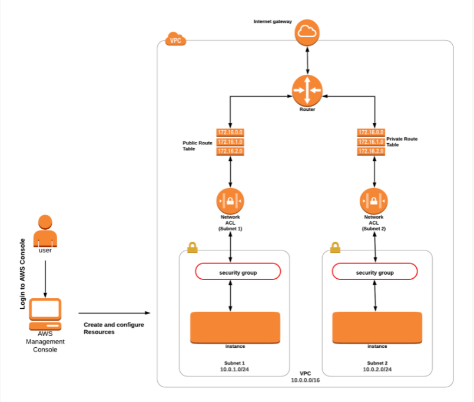

# Hands-On AWS VPC NACL:
-----------------------------


Architecture Diagram
====================



Task Details 
============


1. Launching an EC2 Instance in the Public Subnet

2. Launching an EC2 Instance in the Private Subnet

3. Testing Both EC2 instances.

4. Modifying default NACL and Testing

5. Creating Custom NACL and Associate it to the Subnet

6. Testing the Public and Private Server 

7. Adding Rules to Custom NACL (MyPublicNACL)

8. Testing Both EC2 instances

end. Validation of the lab

Lab Steps
=========


Task 1: Launching an EC2 Instance in the Public Subnet
------------------------------------------------------

1.  Navigate to **EC2** by clicking on the **Services** menu in the top, then click on **ÈC2** in the **Compute**  section.

2.  Navigate to **Instances**from the left side menu and click on **Launch Instances**button.

3.  **Choose an Amazon Machine Image (AMI):** Search for **Amazon Linux 2 AMI** in the search box and click on the **select** button.

4.  Choose an Instance Type: Select **t2.micro** and move on

5. Select your Key pair

6.  Configure Network Settings. Click edit and configure.

    -   **Network        :** Choose **myVPC**

    -   **Subnet            :** Choose **PublicSubnet**

    -   **Auto-assign Public IP    :**  **Enable**

7.  Configure Security Group:

    -   Security group name: Enter** ***MyWebserverSG***

    -   Description : Enter ***My EC2 Security Group***

    -   SSH is already available,

        -   **Choose Type:** ***SSH***

        -   **Source :** Select ***Anywhere*** 

    -   For **HTTP**, click on ***Add Rule***,

    -   **ChooseType:** ***HTTP***

    -   **Source :** Enter ***Anywhere*** (From ALL IP addresses accessible).

8.  Add Storage: No need to change anything in this step.

9. Advanced Details

     -   Under the **User data:** section, enter the following script to create an HTML page served by Apache:

```bash
#!/bin/bash      
yum update -y                                                       
yum install httpd -y                                                
echo "<html><h1>Welcome to my Website</h1\><html>" >> /var/www/html/index.html                                              
systemctl start httpd                                               
systemctl enable httpd                                             
```
   
10. Review the summary.

    -   Review than Launch.


Task 2: Launching an EC2 Instance in the Private Subnet
-------------------------------------------------------

1.  Navigate to **EC2** by clicking on the **Services** menu in the top, then click on **ÈC2** in the **Compute**  section.

2.  Navigate to **Instances**from the left side menu and click on **Launch Instances**button.

3.  **Choose an Amazon Machine Image (AMI):** Search for **Amazon Linux 2 AMI** in the search box and click on the **select** button.

4.  Choose an Instance Type: Select **t2.micro** and move on

5. Select your Key pair

6.  Configure Network Settings. Click edit and configure.

    -   **Network        :** Choose **myVPC**

    -   **Subnet            :** Choose **PrivateSubnet**


7.  Configure Security Group:

    -   Security group name: Enter** ***PrivateSecGr***

    -   Description : Enter ***My Private EC2 Security Group***

    -   SSH is already available,

        -   **Choose Type:** ***SSH***

        -   **Source :** Select ***Anywhere*** 

    -   For **TCP**, click on ***Add Rule***,

    -   **ChooseType:** ***All ICMPv4***

    -   **Source :** Enter ***Anywhere*** (From ALL IP addresses accessible).

8. Add Storage: No need to change anything in this step.

9. Review and launch instance.

10. Note the Private IP Address of Private EC2 Instance.

11. Two servers are launched and ready.


Task 3: Testing Both EC2 instances
-----------------------------------

1.  **Public EC2 instances**: We have installed a web application on  this server.

    -   Select the **Public** EC2 instance from the instance list.

    -   From the Description tab, copy the **IPv4 Public IP**.

    -   Now paste this IP in you Web Browser

    -   You will be able to see a simple web page.
  
2.  Next, we will try to ping the Private EC2 from the Public EC2 instance.

    -   SSH into Public EC2 Instance

-   Copy the Private IP of **PrivateEC2Server** from the Description tab.

-   Ping the Private Instance using the Private IPv4

-   Example:
    ```bash
    ping 172.16.89.89
    ```

-   Press [Ctrl] + C to stop instead of pause.

-   **Note: You were able to do these tasks because the Default NACL that was created during VPC creation allows both INBOUND and  OUTBOUND by Default.**


Task 4: Modifying default NACL and Testing
----------------------------------------------

- Go to VPC service, filter myVPC and find the default NACL for myVPC
- Note that all subnets are associated with it
- Select Network ACL and click Inbound Rules
- Click Edit Inbound Rules to edit
- What you see should look like this

100	All traffic	All	All	0.0.0.0/0	Allow
*	All traffic	All	All	0.0.0.0/0	Deny

- Now add a line after 100 corresponding your IP to deny reach on port 80
100	All traffic	All	All	0.0.0.0/0	Allow
101 HTTP(80) TCP 80    78.45.67.190/32 Deny
*	All traffic	All	All	0.0.0.0/0	Deny

- Save changes
- Now check the public IP of the web instance to see if you can still reach. Can you?
- Now go to default NACL again and this time modify the rule number so that it looks like:
100	All traffic	All	All	0.0.0.0/0	Allow
99 HTTP(80) TCP 80    78.45.67.190/32 Deny
*	All traffic	All	All	0.0.0.0/0	Deny

- Save changes and then check the web instance again. Can you see the page?
- NACL rule numbers are put in ascending order.

Task 5: Creating Custom NACL and Associate it to the Subnet
------------------------------------------------------------

**Note:** By default, all subnets will be associated with the Default NACL of **MyVPC.** Once you create a custom NACL, attach all public and private subnets.

1.  Navigate to **VPC** under the Services menu. Click on ***Network ACL***  under **Security**

2.  Click on **Create Network ACL**

3.  Create Network ACL:

    -   Name tag: Enter ***MyPublicNACL***

    -   VPC: Select **MyVPC****from the dropdown list.

    -   Click on **Create.**

4.  Associating **MyPublicNACL** to the Public Subnet

    -   Select the Action tab and click on **Edit subnet associations**

    -   Select both the **Public and Private** subnets from the table.

    -   Click on **Save changes**

5.  Renaming the Main NACL

    -   Select the **Default NACL** of the VPC MyVPC\

    -   Enter the name ***MyPrivateNACL*** and click on **Save**

Task 6: Testing the Public and Private Server 
-----------------------------------------------

1.  Public EC2 Instance:

    -   Navigate to the **EC2 Instance Dashboard.** Click on   **Instances** from the left side menu.

    -   Select the **PublicEC2Server**EC2 instance from the instance list.

    -   From the Description tab, copy the **IPv4 Public IP**.

    -   Now paste this IP into your web browser and click [Enter]

    -   You will see the following page:\

       **Note: This is because the Custom NACL which is attached to your Public subnet restricts both INBOUND and OUTBOUND traffic.**

2.  Private EC2 Instance:

    -   Since the Public NACL restricts all traffic, you won't be able to SSH into the public EC2 Instance to ping the Private Instance.

    -   Next, we are going to solve this.

Task 7: Adding Rules to Custom NACL (MyPublicNACL)
---------------------------------------------------

1.  Navigate to **VPC** under the **Services** menu. Click on **Network ACLs**    under **Security.**

2.  Select **MyPublicNACL** from the list.

3.  In the Inbound rules, click **Edit inbound rules**

4.  Add the following rules:

    -   **HTTP** click on **Add rules,**

        -   Rule# : Enter ***100***

        -   Type: Choose **HTTP (80)**

        -   Source: Enter ***0.0.0.0/0***

        -   Allow / Deny: Select Allow

    -   For **ALL ICMP- IPv4**, click on **Add rules**,

        -   **Rule#** : Enter ***150***

        -   Type: Choose**ALL ICMP - IPv4 **

        -   Source: Enter ***0.0.0.0/0***

        -   Allow / Deny: Select Allow

    -   For **SSH**, click on **Add rules**,

        -   **Rule# : Enter** ***200***

        -   Type: Choose **SSH (22) **

        -   Source: Enter ***0.0.0.0/0***

        -   Allow / Deny: Select Allow\

        -   Click on **Save changes**

5.  In the **Outbound rules** Tab, Click Edit outbound rules

6.  Add the following rules:

    -   **Custom Port** is already available,

        -   Rule# : Enter ***100***

        -   Type: Choose **Custom TCP Rule**

        -   Port Range: Enter ***1024 - 65535***

        -   Source: Enter ***0.0.0.0/0***

        -   Allow / Deny: Select *Allow*

    -   For **ALL ICMP- IPv4**, click on **Add rules**,

        -   Rule\# : Enter ***150***

        -   Type: Choose **ALL ICMP - IPv4 **

        -   Source: Enter ***0.0.0.0/0***

        -   Allow / Deny: Select Allow

    -   For **SSH**, click on **Add rules** ,

        -   Rule# : Enter ***200***

        -   Type: Choose **SSH (22) **

        -   Source: Enter******0.0.0.0/0**

        -   Allow / Deny: Select Allow
           
        -   Click on **Save**

Task 8: Testing Both EC2 instances
-----------------------------------

1.  We will try to ping the Private EC2 from the Public EC2 instance.

    -   SSH into EC2 Instance

    -   Copy the Private IP of **MyPrivateEC2Server** from the Description tab.![]

    -   Ping to the Private Instance using the Private IPv4


-   Press [Ctrl] + C again to cancel the process instead of pausing it.

-   Note: You were able to do these tasks because we added NACL Rules.


End Lab 
