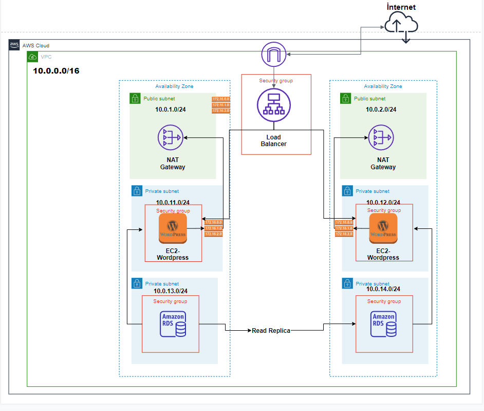

Configuring and Deploying Amazon VPC for Wordpress
=========================================================

Overview
------------

This lab demonstrates how to set up a VPC infrastructure to support a basic Wordpress application in your AWS Cloud environment. The VPC will be built across multiple Availability Zones so that your application is highly available. Let's get a quick overview of what a VPC is and how Elastic Load Balancing works.



**Amazon Virtual Private Cloud (Amazon VPC)** lets you provision a logically isolated section of the AWS Cloud where you can launch AWS resources in a virtual network that you define. You have complete control over your virtual networking environment, including selection of your own IP address range, creation of subnets, and configuration of route tables and network gateways. You can use both IPv4 and IPv6 in your VPC for secure and easy access to resources and applications.

You can easily customize the network configuration of your Amazon VPC. For example, you can create a public-facing subnet for your web servers that have access to the internet. You can also place your backend systems, such as databases or application servers, in a private-facing subnet with no internet access. You can use multiple layers of security, including security groups and network access control lists, to help control access to Amazon EC2 instances in each subnet.

For more information about VPC you can view the AWS Documentation using the following link:

[https://docs.aws.amazon.com/vpc/latest/userguide/how-it-works.html](https://docs.aws.amazon.com/vpc/latest/userguide/how-it-works.html)

### Topics Covered

-   Build a VPC
-   Create public and private subnets
-   Configure the internet gateway and NAT gateway/instance
-   Ensure your resources are securely deployed within the VPC

### Technical Knowledge Prerequisites

To successfully complete this lab, you should be familiar with basic navigation of the AWS Management Console and be comfortable editing scripts using a text editor.


Task 1: Creating a VPC 
----------------------

In this task, you create a new VPC in the AWS Cloud.

1.  In the AWS Management Console, choose Services and select  **VPC**. (You may also type VPC in the search bar and choose VPC.)

2.  Choose **Your VPCs** on the left navigation menu.

** **Note**: You will see a default VPC (one is created whenever an AWS account is created). To learn more about default VPC, go to [Default VPC and default subnets](https://docs.aws.amazon.com/vpc/latest/userguide/default-vpc.html)

3.  Choose Create VPC on the right side of the console.

4.  In the Create VPC section, enter the following:

-   **Name tag**: Enter **WebVPC**

-   **IPv4 CIDR block**: Enter **10.0.0.0/16**

** **Note**: This VPC will not have an IPv6 CIDR block, and we will leave it with default tenancy.

5.  Choose ```Create VPC``

A VPC with the specified CIDR block has been created. Now, let's create the subnets.

Task 2: Creating subnets
------------------------

A subnet is a range of IP addresses in your VPC. You can launch AWS resources into a specified subnet. Use a public subnet for resources that must be connected to the internet and a private subnet for resources that won't be connected to the internet. To protect the AWS resources in each subnet, you can use multiple layers of security, including security groups and network access control lists (ACL).

In this task, you create two public subnets and four private subnets in the *WebVPC* (as shown in the architecture diagram above).

### Create public subnets

The public subnets will be for internet-facing resources.

6.  In the left navigation pane, choose **Subnets**.

**Note**: You will see subnets for the default VPC. You can ignore  them and go to the next step.

7.  Choose Create subnet and configure it with the following details:

-   **VPC ID**: Select *WebVPC*
-   **Subnet name**: Enter *PublicSubnet-A*
-   **Availability Zone**: Select the first Availability Zone in the list
-   **IPv4 CIDR block**: Enter *10.0.1.0/24*

8. Choose ```Create subnet```

** **Note**: When you create a VPC, you must specify an IPv4 CIDR block for the VPC. The allowed block size is between a /16 netmask (65,536 IP addresses) and /28 netmask (16 IP addresses). The CIDR block of a subnet can be the same as the CIDR block for the VPC (for a single subnet in the VPC) or a subset of the CIDR block for the VPC (for multiple subnets). If you create more than one subnet in a VPC, the CIDR blocks of the subnets cannot overlap.

Tools are available on the internet to help you calculate and create IPv4 subnet CIDR blocks; for example, [IPv4 Address Planner](https://network00.com/NetworkTools/IPv4AddressPlanner/).

One public subnet has been created. Now, create the other public subnet with the following details:

-   **VPC ID**: Select *WebVPC*
-   **Subnet name**: Enter *PublicSubnet-B*
-   **Availability Zone**: Select the second Availability Zone in the list
-   **IPv4 CIDR block**: Enter *10.0.2.0/24*


** **Note**: Even though we named these subnets PublicSubnet, they are not yet public. A public subnet must have an internet gateway, which you will create and attach later in the lab.

### Create private subnets

The private subnets are for resources that remain isolated from the internet. In this lab, we create two private subnets for the EC2 instances and two private subnets for the RDS instances.

9. Create the four private subnets with the following details:

-   **PrivateSubnet-A1**:

    -   **VPC ID**: Select *WebVPC*
    -   **Subnet name**: Enter **PrivateSubnet-A1**
    -   **Availability Zone**: Select the first Availability Zone in the list
    -   **IPv4 CIDR block**: Enter *10.0.11.0/24*

-   **PrivateSubnet-B1**:

    -   **VPC ID**: Select *WebVPC*
    -   **Subnet name**: Enter *PrivateSubnet-B1*
    -   **Availability Zone**: Select the second Availability Zone in the list
    -   **IPv4 CIDR block**: Enter *10.0.12.0/24*

-   **PrivateSubnet-A2**:

    -   **VPC ID**: Select *WebVPC*
    -   **Subnet name**: Enter *PrivateSubnet-A2*
    -   **Availability Zone**: Select the first Availability Zone in the list
    -   **IPv4 CIDR block**: Enter *10.0.13.0/24*

-   **PrivateSubnet-B2**:

    -   **VPC ID**: Select *WebVPC*
    -   **Name tag**: Enter  **PrivateSubnet-B2**
    -   **Availability Zone**: Select the second Availability Zone in the list
    -   **IPv4 CIDR block**: Enter *10.0.14.0/24*

Your VPC now has six subnets in total: two public subnets for the Application Load Balancer in two different Availability Zones, two subnets for the EC2 instances in two different Availability Zones, and two subnets for the RDS instances in two different Availability Zones. 

Task 3: Creating an internet gateway
------------------------------------

An internet gateway is a horizontally scaled, redundant, and highly available VPC component that allows communication between instances in a VPC and the internet. An internet gateway does not impose availability risks or bandwidth constraints on network traffic.

An internet gateway serves two purposes:

-   Provide a target in route tables to connect to the internet
-   Perform network address translation (NAT) for instances that have been assigned public IPv4 addresses.

In this task, you create an internet gateway.

10. In the left navigation pane, choose **Internet Gateways**.

** **Note**: A default internet gateway was created with the default VPC. You can ignore this and proceed with the next step.

11. Choose Create internet gateway and configure:

-   **Name tag**: Enter *WebIGW*

12. Choose ```Create internet gateway```

Once it's created, you need to attach the internet gateway to your  VPC.

13. Choose ```Actions``` > **Attach to VPC**.

14. For **VPC**, select *WebVPC*

15. Choose ```Attach internet gateway```

The internet gateway is now attached to your WebVPC. You have created an internet gateway and attached it to your VPC, and you must now configure the route table of the public subnets to use the internet
gateway. You'll do that after you create your NAT gateway.

Task 4: Creating a NAT gateway / NAT instance
------------------------------

You can use a network address translation (NAT) gateway / NAT instance to enable instances in a private subnet to connect to the internet or other AWS services. The NAT gateway also prevents the internet from initiating a connection with those instances. For more information, see [NAT](https://docs.aws.amazon.com/vpc/latest/userguide/vpc-nat.html).

In this task, you create a NAT gateway so that the private subnets can connect to the internet.

16. In the left navigation pane, choose **NAT Gateways**.

17. Choose **Create NAT gateway** and configure:

-   **Name**: Enter *WebNATGW*
-   **Subnet**: Select *PublicSubnet-A*
-   **Elastic IP allocation ID**: Choose ```Allocate Elastic IP```

This will generate an Elastic IP address and will allocate it to the NAT gateway.

*An Elastic IP address is a public IPv4 address that is reachable from the internet. If your instance does not have a public IPv4 address, you can associate an Elastic IP address with your instance to enable
communication with the internet. For example, this allows you to connect to your instance from your local computer.* 

18. Choose **Create NAT gateway**

The NAT gateway has been created. You must now configure the route table of the private subnets to use the NAT gateway.

>>> 

**Create NAT Instance**

1)

- Go to EC2 to Launch Instance
- Choose an AMI that serves as nat by searching `nat` in AMI search.
- Create the nat instance in WebVPC on one of the Public Subnets.
- Configure the route tables. 
- Change source/destination check configuration

2)
- you can create a Linux AMI 2 instance and run script on shell terminal to make it behave like a Nat instance.

```bash
#!/bin/bash
echo 1 > /proc/sys/net/ipv4/ip_forward
iptables -t nat -A POSTROUTING -s 10.0.0.0/16 -j MASQUERADE
```
- Configure route tables.
- Change source/destination check configuration.
>>>


Task 5: Configuring route tables
--------------------------------

A route table contains a set of rules, called *routes*, used to determine where network traffic is directed. Each subnet in a VPC must be associated with a route table, which controls the routing for the
subnet. A subnet can only be associated with one route table at a time, but you can associate multiple subnets with the same route table.

In this task, you configure two route tables, one for the public subnets and one for the private subnets.

### Configure public route table

To use an internet gateway, a subnet's route table must contain a route that directs internet-bound traffic to the internet gateway. This subnet is called a *public subnet*.

You will:

-   Create a public route table for internet-bound traffic 
-   Add a route to the route table to direct internet-bound traffic to the internet gateway
-   Associate the public subnets with the new route table

21. In the left navigation pane, choose **Route Tables**.

Several route tables are displayed, but there is only one route table associated with the  VPC. This is the main route table.

22. Choose **Create route table** and configure:

-   **Name tag**: Enter *PublicRouteTable*
-   **VPC**: Select *WebVPC*

23. Choose **Create** and then choose **Close**

24. Select ** **PublicRouteTable** and choose the **Routes** tab.

25. Choose **Edit routes**

Now, add a route to direct internet-bound traffic (0.0.0.0/0) to the internet gateway.

26. Choose **Add route** and configure:

-   **Destination**: Enter *0.0.0.0/0*

-   **Target**: Select *Internet Gateway* and *WebIGW*.

27. Choose **Save routes** and then choose **Close**

The last step is to associate this new route table with the public subnets.

28. Choose the **Subnet Associations** tab.

29. Choose **Edit subnet associations**

30. On the Edit subnet associations page, select the rows with *PublicSubnet-A* and *PublicSubnet-B*.

31. Choose **Save**

The PublicSubnet is now public because it has a route table entry that sends traffic to the internet via the internet gateway.

### Configure private route table

To use a NAT gateway, you must update the route table associated with one or more of your private subnets to point internet-bound traffic to the NAT gateway. This enables instances in your private subnets to
communicate with the internet, mainly for any upgrades that needs to be installed.

You will:

-   Create a private route table for private subnets
-   Add a route to the route table for the NAT gateway/ NAT instance
-   Associate the private subnets with the new route table

32. Choose **Create route table** and configure it with the following details:

-   **Name tag**: Enter *PrivateRouteTable*
-   **VPC**: Select *WebVPC*

33. Choose **Create** and then choose **Close**

34. Select ** **PrivateRouteTable** and choose the **Routes** tab.

35. Choose **Edit routes**

In the next step, you add a route to direct internet-bound traffic (0.0.0.0/0) to the NAT gateway/ NAT Instance

36. Choose **Add route** and configure:

-   **Destination**: Enter *0.0.0.0/0*
-   **Target**: Select *NAT Gateway* and *WebNATGW*.
- for NAT instance **Target**: Select Instance and then Nat instance

37. Choose **Save routes** and then choose **Close**

The last step is to associate this new route table with the private subnets.

38. Choose the **Subnet Associations** tab.

39. Choose **Edit subnet associations**

40. On the Edit subnet associations page, select all of the rows with  *PrivateSubnet*.

** **Note**: You may need to expand the Subnet ID column to see their full names.

41. Choose **Save**

You have successfully created a route table and associated the private subnets to the NAT gateway/ NAT instance in the public subnet so that the incoming traffic can reach the private subnets.

** **Note**: If you have resources in multiple Availability Zones that share one NAT gateway, and if the NAT gateway’s Availability Zone is down, resources in the other Availability Zones lose internet access. To create an AZ-independent architecture, create a NAT gateway in at least two Availability Zones that Amazon CloudWatch can monitor and configure your routing to ensure resources use the NAT gateway in the same Availability Zone.
However a single NAT instance on a public subnet is sufficient for the whole VPC. 

Task 6: Creating security groups
--------------------------------

A security group acts as a virtual firewall for instances, controlling inbound and outbound traffic. Security groups operate at the instance network interface level, not the subnet level. Therefore, each instance
can have its own firewall that controls traffic. If you do not specify a particular security group at launch time, the instance is automatically assigned to the default security group for the VPC.

In this task, you create three security groups for this lab: one for the RDS instances, one for the EC2 instances, and one for the Application Load Balancer (ALB). *The ALBSecurityGroup allows the application to be accessed from the internet.*

42. In the left navigation pane, choose **Security Groups**.

43. Choose **Create security group**  and configure it with the following details:

-   **Security group name**: Enter *WebALB-SG*
-   **Description**: Enter *Allows web access*
-   **VPC**: Select *WebVPC*

44. For **Inbound rules**, choose Add rule and configure it with the following details:

-   **Type** : Select *All traffic*
-   **Source**: Select *0.0.0.0/0* (Anywhere)

45. For **Tags - optional**, choose Add new tag and configure it with     the following details:

-   **Key**: Enter *Name*
-   **Value**: Enter *WebALB-SG*

** **Note**: By adding tags, it will be easy to identify the subnets in the subnet list.

46. At the bottom of the page, choose **Create security group**

The inbound rules determine what traffic is permitted to reach the instance. You have configured it to permit HTTP (port 80) traffic coming from anywhere on the internet (0.0.0.0/0).

You will create the security group for the EC2 instances. *Only the ALBSecurityGroup will be allowed to talk to the EC2 instances.*

47. In the left navigation pane, choose **Security Groups**.

48. Create another new security group with the following details:

-   **Security group name**: Enter *WebEC2-SG*
-   **Description**: Enter *Allows ALB to access the EC2 instances*
-   **VPC**: Select *WebVPC*

49. For **Inbound rules**, choose Add rule and configure it with the
    following details:

-   **Type**: Select *HTTP*
-   **Port range**: Select *80*
-   **Source**: Select *WebALB-SG*

 add SSH for troubleshooting from a Public instance.
-   **Type**: Select *SSH*
-   **Port range**: Select *22*
-   **Source**: Select Custom *10.0.0.0/16*

51. Create a new tag with the following details:

-   **Key**: Enter *Name*
-   **Value**: Enter *WebEC2-SG*

52. Choose **Create security group**

You have configured the inbound rules to permit ALB (ports 80 and 8443) traffic to the EC2 instances.

Now, you will create an *RDSSecurityGroup* so the EC2 instances can communicate to the RDS instances.

53. In the left navigation pane, choose **Security Groups**.

54. Create the last security group with the following details:

-   **Security group name**: Enter *WebRDS-SG*
-   **Description**: Enter *Allows application to access the RDS instances*
-   **VPC**: Select *WebVPC*

55. Add the following inbound rule:

-   **Type**: Select *MYSQL/Aurora*
-   **Port range**: *3306*
-   **Source**: Select *WebEC2-SG*

56. Add the following tag:

-   **Key**: Enter *Name*
-   **Value**: Enter *WebRDS-SG*

This will allow the EC2 instances to communicate with the RDS instances on port 3306.

- If you use **NAT Instance**, create a Security Group for it.

As Wordpress instance will reach NAT instance inbound should be set for NAT instance.

Add the following inbound rule for troubleshooting:

-   **Type**: Select *SSH*
-   **Port range**: *22*
-   **Source**: Click Custom *my-ip*

Add the following inbound rule for the private instances to reach NAT instance from VPC:
-   **Type**: Select *All traffic*
-   **Port range**: *All*
-   **Source**: Select Custom *10.0.0.0/16*

** **Note**: You can grant access to a specific CIDR range, or to another security group in your VPC or in a peer VPC (requires a VPC peering connection). When you specify a security group as the source for a rule, traffic is allowed from the network interfaces that are associated with the source security group for the specified protocol and port. Incoming traffic is allowed based on the private IP addresses of the network interfaces that are associated with the source security group (and not the public IP or Elastic IP addresses). Adding a security group as a source does not add rules from the source security group.

Task 7: Launch web app instances and database resources, and deploy the application
-----------------------------------------------------------------------------------

In this task, you provision the RDS and EC2 instances in the private subnets and configure an Application Load Balancer in the public subnets.

### Create the database in the private subnets

Create a DB (database) subnet group so that the RDS will be deployed  within the subnets you want to use.

57. On the *Services* menu, type *RDS* in the search bar and choose RDS.

58. In the left navigation pane, choose *Subnet groups*.

59. Choose **Create DB subnet group**  and configure it with the following details:

-   **Name**: Enter *WebRDS-SubnetGrp*
-   **Description**: Enter *Subnet group for RDS*
-   **VPC**: Select *WebVPC*
-   **Availability Zones**: Select the two Availability Zones you used to create the subnets (they should be the first two listed).
-   **Subnets**: Choose *10.0.13.0/24* and *10.0.14.0/24*

60. Choose **Create**

The DB subnet group has been created successfully. Now let's create the database.

61. In the left navigation pane, choose **Databases**.

62. Choose **Create database** and configure it with the following details:

-   **Choose a database creation method**: *Standard Create*
-   **Engine Options**:
    -   **Engine type**: Select *MySQL*
    -   **Edition**: Select *MySQL Community *
    -   **Version**: Select *default*
-   **Templates**: Select *Free tier*

-   **Settings**:

    -   **DB instance identifier**: Enter *WebDB*
    -   **Master username**: Leave the default as *admin*
    -   **Master password**: Enter *Admin12345*
    -   **Confirm password**: Enter *Admin12345*
    -   **DB instance size**: Select *Burstable classes* and select  *db.t2.micro*
    -   **Storage**: Leave as is, uncheck Enable storage autoscaling
    -   **Connectivity**: Leave as is.
    -   **Virtual private cloud(VPC)**: Select *WebVPC*
    

63. Choose ** **Additional connectivity configuration**

-   **Subnet group**: Select *WebRDS-SubnetGrp*
-   **Public access**: Select *No*
-   **VPC security group**: Select *Choose existing*
-   **Existing VPC security groups**: Select *WebRDS-SG* and remove *default*
-   **Availability Zone**: No preference
-   **Database port**: Select *3306*
-   **Monitoring**: Uncheck Enable enhanced monitoring

64. Choose ** **Additional Configuration**

-   **Initial database name**: Enter *WordpressDB*

65. Uncheck *Enable automated backups* under **Backup** section.

- Uncheck Enable encryption under **Encryption**.
- Uncheck Enable auto minor version upgrade under **Maintenance**.

The other values will be left to the default values selected.

66. Choose **Create database**

This will create a writer instance in one Availability Zone and a reader instance in the other Availability Zone. It will take few minutes to complete. Choose the refresh button to see the status updated. You can
proceed once you receive the *Successfully created database* message.

67. Choose *WebDB-Cluster* under **DB identifier** and then copy the *Endpoint name* under **Endpoints** for the *Writer* type and the *Reader* type. These will be needed when the application is deployed
    on the EC2 instances.

** **Note**: The database may initially show two *Reader* types, but it will show the *Writer* type once the creation is complete.

### Configure the EC2 instances

The next step is to create the EC2 instances and deploy the application code. If you want the application to be highly available in different Availability Zones, it's a good practice to create a *launch template*
and reuse it for deploying the EC2 instance instead of creating from scratch every time.

You will create the *launch template* first.

68. On the *Services* menu, choose EC2.

69. In the left navigation pane, choose **Launch templates**.

70. Choose **Create launch template** and configure it with the  following details:

-   **Launch template name and description**:
    -   **Launch template name**: Enter *WebEC2-Template*
    -   **Template version description**: Enter *Template to launch EC2 instance and deploy the application*
-   **Amazon machine image (AMI)**:
    -   **AMI**: Select *Amazon Linux 2 AMI (HVM), SSD Volume Type*
-   **Instance type**:
    -   **Instance type**: Select *t2.micro*
-   **Network settings**:
    -   **Networking platform**: Select *Virtual Private Cloud (VPC)*
    -   **Security groups**: Select *WebEC2-SG*


-   **User data**: Copy and paste the following script into the empty field.

```bash
#!/bin/bash
db_username=admin
db_user_password=Admin12345
db_name=WordpressDB
db_user_host=database-1.chs2jc50cfzy.us-east-1.rds.amazonaws.com
yum update -y
amazon-linux-extras install -y lamp-mariadb10.2-php7.2 php7.2
yum install -y httpd
systemctl start httpd
systemctl enable httpd
wget https://wordpress.org/latest.tar.gz
tar -xzf latest.tar.gz
sudo cp -r wordpress/* /var/www/html/
cd /var/www/html/
cp wp-config-sample.php wp-config.php
chown -R apache /var/www
chgrp -R apache /var/www
chmod -R 775 /var/www
sed -i "s/database_name_here/$db_name/g" wp-config.php
sed -i "s/username_here/$db_username/g" wp-config.php
sed -i "s/password_here/$db_user_password/g" wp-config.php
sed -i "s/localhost/$db_user_host/g" wp-config.php
systemctl restart httpd
```

71. Replace all of the text after db_username, db_user_password, db_name =** with the  *Reader* DB *Endpoint name* that you copied earlier. When you do so,  be sure to replace all of the text after =.

*This script deploys the application on the EC2 instance along with the EC2 launch process.*

72. De-select ** **User data has already been base64 encoded**.

73. Choose **Create launch template**

74. At the bottom of the page, choose **View launch templates**

75. In the left navigation pane, choose **EC2 Dashboard**

=========================================
***Do not forget to configure source/destination check and Route Table for Private Subnets if you use NAT Instance.***
=========================================

76. Choose **Launch instance ****

77. Select **Launch instance from template** and configure it with the following details:

-   **Choose a launch template**:
    -   **Source template**: Select *WebEC2-Template*
-   **Network settings**:
    -   **Subnet**: Select *PrivateSubnet-A1*

78. Choose **Add tag**

-   **Key**: Enter *Name*
-   **Value**: Enter *WordpressServer-A1*

79. Under **Resource tags**, choose **Launch instance from template**.

80. Under **Key pair (login)** choose *Proceed without a key pair(Not recommended)*

81. Choose **View launch template**

82. Choose **Instances**, and you can see the new EC2 instance    **WordpressServer-A** being launched.

83. Wait until **WordpressServer-A** shows *2/2 checks passed* in the  **Status Checks** column.

-   This will take 3-5 minutes. Press the refresh icon ** in the upper-right pane to check for updates.

The EC2 instance along with the application code has been deployed successfully.

### Create an Application Load Balancer

You will create an Application Load Balancer in the public subnets to access the application from a browser.

84. In the left navigation pane, choose **Load Balancers**.

85. Choose **Create Load Balancer**

86. Choose **Create** in the **Applicaton Load Balancer** column.

87. Configure the **Configure Load Balancer** tab with the following   details:

-   **Basic Configuration**:
    -   **Name**: Enter *WebALB*
-   **Availability Zones**:
    -   **VPC**: Select *WebVPC*
    -   **Availability Zones**:
        -   Select the check box for the first Availability Zone listed, and select  *PublicSubnet-A* from the subnet list.
        -   Select the check box for the second Availability Zone listed, and select *PublicSubnet-B* from the subnet list.

88. Click *Next: Configure Security Settings*

** **Note**: It's always best practices to use a secure listener for the load balancer. For this lab, you can ignore the warning and proceed.

89. Click Next: Configure Security Groups and configure the following:

-   **Assign a security group**: *Select an existing security group* 
-   Select *WebALB-SG*

** **Note**: If *defaultSG* is selected by default, unselect it.

90. Click Next: Configure Routing and configure the following:

-   **Name**: Enter *WebALB-TG*

91. Click Next: *Register Targets* and configure the following:

-   **Instances**:
    -   Select the EC2 instance that has been deployed in the previous steps.
    -   Choose **Add to registered**

The instance will now appear under the **Registered targets** at the top.

92. Click *Next: Review* and review all the field values and choose **Create**.

93. Choose **Close**

The load balancer will appear to be in the *provisioning* state for few minutes and will then change to *active*.

94. Select the check box for the load balancer .

95. From the **Description** tab, copy the **DNS Name** and paste the  value in a new browser to invoke the load balancer.


96. >>>>>>>>>>>>>>>>>>>>>>>>>>>>>>>>>>>>>>>>>>>  ***Second AZ for HA***


Deploy an EC2 instance in the private subnet of the **second Availability Zone**, 
connect to the read replica of the Aurora database, and register the EC2 instance in the Application Load Balancer.

97. In the left navigation pane, choose **EC2 Dashboard**.

98. Choose **Launch instance ****

99. Select **Launch instance from template** and configure:

-   **Source template**: Select *WebEC2-Template*
-   **Subnet**: Select *PrivateSubnet-B1*

100. In the **Resource tags** section, choose **Add tag** and configure:

-   **Key**: Enter *Name*
-   **Value**: Enter *WordpressServer-B*

-   **User data**: Copy and paste the following script.

```bash
#!/bin/bash
db_username=admin
db_user_password=Admin12345
db_name=WordpressDB
db_user_host= ------write read replica endpoint -------
yum update -y
amazon-linux-extras install -y lamp-mariadb10.2-php7.2 php7.2
yum install -y httpd
systemctl start httpd
systemctl enable httpd
wget https://wordpress.org/latest.tar.gz
tar -xzf latest.tar.gz
sudo cp -r wordpress/* /var/www/html/
cd /var/www/html/
cp wp-config-sample.php wp-config.php
chown -R apache /var/www
chgrp -R apache /var/www
chmod 775 /var/www
find /var/www -type d -exec sudo chmod 2775 {} \;
find /var/www -type f -exec sudo chmod 0664 {} \;
sed -i "s/database_name_here/$db_name/g" wp-config.php
sed -i "s/username_here/$db_username/g" wp-config.php
sed -i "s/password_here/$db_user_password/g" wp-config.php
sed -i "s/localhost/$db_user_host/g" wp-config.php
systemctl restart httpd
```

101. Replace all of the text after db_username, db_user_password, db_name, db_user_host =** with the  *Reader* DB *Endpoint name* that you copied earlier. When you do so,  be sure to replace all of the text after =.

102. Choose **Launch instance from template**.

103. Choose **View launch template**

104. Choose **Running instances**, and you can see the new EC2 instance  **WordpressServer-B** being launched.

105. Choose *refresh* button to see the new instance in the list.

106. Wait until **WordpressServer-B** shows *2/2 checks passed* in the  **Status Checks** column.

-   This will take 3-5 minutes. Press the refresh icon ** in the  upper-right pane to check for updates.

Next step will be to configure the above EC2 instance in the load balancer.

107. In the left navigation pane, choose **Target Groups**.

108. Choose the **WebVPCALBTargetGroup**.

109. Choose the **Targets** tab.

110. Choose **Register Targets**.

111. Select the check box for the *WordpressServer-B*.

112. Change the port value to in the **Ports for the selected instances** text box.

113. Choose **Include as pending below**

The selected instance will appear in the bottom panel of the registered targets.

114. Choose **Register pending targets**

Wait until the **Status** changes its value from *initial* to *healthy*.

Now the load balancer is configured to talk to both EC2 instances. Try running the application from the browser with the load balancer *DNS Name*.


Congratulations...


